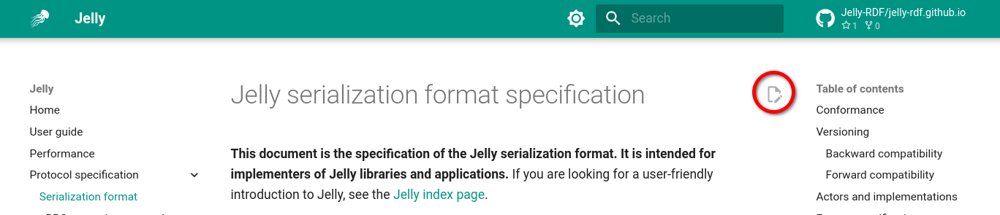

# Contributing

Jelly is an open project – **you are welcome to submit issues, pull requests, or just ask questions**.

## Contributing to the Jelly specification

The Jelly Protocol Buffers and gRPC definitions are in the [jelly-protobuf repository](https://github.com/Jelly-RDF/jelly-protobuf). If you want to contribute to the specification, it is strongly recommended that you first **[open an issue there](https://github.com/Jelly-RDF/jelly-protobuf/issues/new/choose)** to discuss your idea.

The [specification documents](specification/index.md) are edited in the same way as other documentation pages. See the next section for details.

## Editing documentation

The documentation is written in Markdown and built using [MkDocs](https://www.mkdocs.org/), using [Material for MkDocs](https://squidfunk.github.io/mkdocs-material/).

To edit a documentation page, simply click the :material-file-edit-outline: button in the top-right of the page:



It will take you to GitHub, where you can edit the Markdown file and submit a pull request. You can also clone [the repository](https://github.com/Jelly-RDF/jelly-rdf.github.io) and edit the files locally. The source files are in the `docs` directory.

Note: the `reference.md` file is automatically generated from the Jelly Protocol Buffers definitions. Do not edit it directly.

### Macros

The documentation makes use of several macros for generating links, displaying the software version, etc. The macros are used in the Markdown files like this:

```markdown
**Version**: {{ '{{ proto_version() }}' }}
```

Which yields: 

> **Version**: {{ proto_version() }}

The list of available macros can be found in the [`main.py` file]({{ git_docs_link('main.py') }}) in the root of the repository.

### Local testing of the website

Install the project's dependencies from `requirements.txt` (preferably in a virtual environment). Then, run `mkdocs serve` to compile the docs and serve them locally for testing.

```bash
# Create a virtual environment – use your preferred tool here
python3 -m venv venv
source venv/bin/activate

# Install dependencies
pip install -r requirements.txt

# Run the local server
mkdocs serve
```

### Editing Jelly-JVM documentation

Use the exact same process as for the website documentation. The Jelly-JVM documentation sources are in the [`jelly-jvm` repository](https://github.com/Jelly-RDF/jelly-jvm), `docs/docs` directory.

## Contributing to Jelly implementations

### Jelly-JVM

- **[Jelly-JVM documentation]({{ jvm_link()}})** includes the developer guide, explaining the technical aspects of contributing to it.
- **[GitHub repository](https://github.com/Jelly-RDF/jelly-jvm)**
- **[Issue tracker](https://github.com/Jelly-RDF/jelly-jvm/issues)**
