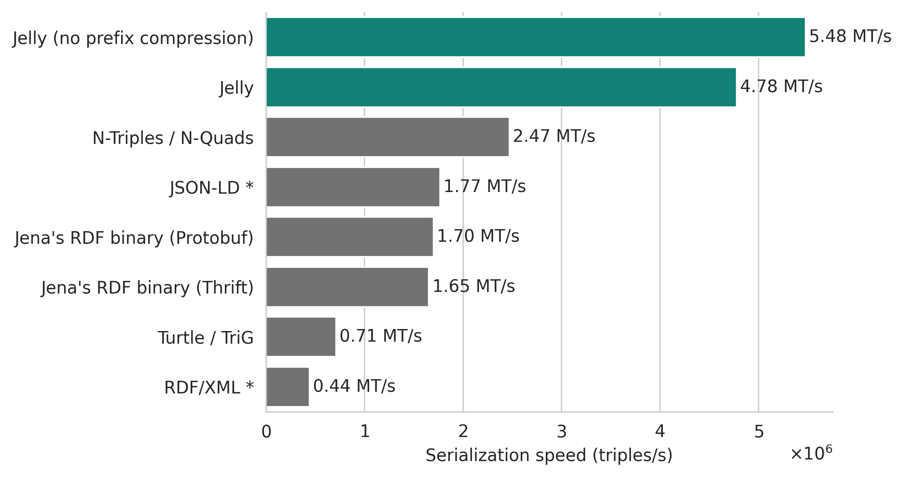

{ align=right width="150" }

# Jelly

**Jelly** is a high-performance binary serialization format and streaming protocol for [RDF](https://en.wikipedia.org/wiki/Resource_Description_Framework) knowledge graphs. Jelly has implementations for the [JVM]({{ jvm_link() }}) (works with [Apache Jena](https://jena.apache.org/), [RDF4J](https://rdf4j.org/), and [Titanium](https://github.com/filip26/titanium-rdf-api)) and [Python]({{ python_link() }}) (works with [rdflib](https://rdflib.readthedocs.io/en/stable/)).

-   :material-clock-fast:{ .lg .middle } __Stream any RDF data, <u>fast</u>__

    ---

    Jelly is blazing-fast by design, and can work with streams of triples, graphs, datasets, and more.

    [:octicons-arrow-right-24: Getting started](user-guide.md)

-   :fontawesome-solid-code:{ .lg .middle } __JVM and Python implementations__

    ---

    Fully-integrated support for [Apache Jena](https://jena.apache.org/), [RDF4J](https://rdf4j.org/), [Titanium](https://github.com/filip26/titanium-rdf-api), and [rdflib](https://rdflib.readthedocs.io/en/stable/).

    [:octicons-arrow-right-24: Jelly-JVM]({{ jvm_link() }})

    [:octicons-arrow-right-24: pyjelly]({{ python_link() }})

-   :fontawesome-solid-angles-right:{ .lg .middle } __End-to-end streaming__

    ---

    Jelly comes with a [gRPC](https://grpc.io/) protocol and can work with Kafka, MQTT, and others.

    [:octicons-arrow-right-24: User guide](user-guide.md)

    [:octicons-arrow-right-24: Streaming with Jelly-JVM]({{ jvm_link( 'user/reactive' ) }})

-   :fontawesome-solid-book:{ .lg .middle } __Open specification__

    ---

    Everything is open-source and well-documented to help you get started.

    [:octicons-arrow-right-24: Protocol specification](specification/index.md)

## How fast is it?

*Fast.* Jelly was specifically designed to serialize and deserialize streams of RDF data faster than N-Triples or other binary formats, while being [more compact than Turtle](performance/index.md#grouped-streaming-serialized-size).

The benchmarks below were performed on streams of RDF graphs or datasets, but Jelly is also good at handling streams of triples or quads ("classic" serialization). The benchmark was performed with Jelly-JVM 2.7.0 with Apache Jena 5.3.0. See: **[more benchmark results and details about the benchmark setup](performance/index.md)**.

<figure markdown="span">
  { width="100%" }
  <figcaption markdown style="max-width: 100%;">Serialization speed of a stream of RDF graphs or RDF datasets, averaged over 13 datasets (RiverBench 2.1.0 profile [`stream-mixed-rdfstar`](https://w3id.org/riverbench/v/2.1.0/profiles/stream-mixed-rdfstar), task [`stream-serialization-throughput`](https://w3id.org/riverbench/v/2.1.0/tasks/stream-serialization-throughput)). * Partial results for RDF/XML and JSON-LD (some datasets not supported). [More details about the benchmark](performance/index.md).</figcaption>
</figure>

<figure markdown="span">
  { width="100%" }
  <figcaption markdown style="max-width: 100%;">Deserialization (parsing) speed of a stream of RDF graphs or RDF datasets, averaged over 13 datasets (RiverBench 2.1.0 profile [`stream-mixed-rdfstar`](https://w3id.org/riverbench/v/2.1.0/profiles/stream-mixed-rdfstar), task [`stream-deserialization-throughput`](https://w3id.org/riverbench/v/2.1.0/tasks/stream-deserialization-throughput)). * Partial results for RDF/XML and JSON-LD (some datasets not supported). [More details about the benchmark](performance/index.md).</figcaption>
</figure>

## Commercial and community support

**[NeverBlink](https://neverblink.eu)** provides commercial support services for Jelly, including implementing custom features, system integrations, implementations for new frameworks, benchmarking, and more.

Community support is available on the **[Jelly Discord chat](https://discord.gg/A8sN5XwVa5)**.

## See also

- **[User guide](user-guide.md)**
- **[Performance benchmarks](performance/index.md)**
- **[Protocol specification](specification/index.md)**
- **[Contributing to Jelly](contributing/index.md)**
- **[Discord chat](https://discord.gg/A8sN5XwVa5)**
- **Code on GitHub:** 
    - [Protocol definition](https://github.com/Jelly-RDF/jelly-protobuf)
    - [JVM implementation](https://github.com/Jelly-RDF/jelly-jvm)
    - [Python implementation](https://github.com/Jelly-RDF/pyjelly)
    - [Command-line utility (`jelly-cli`)](https://github.com/Jelly-RDF/cli)
    - [Website](https://github.com/Jelly-RDF/jelly-rdf.github.io)
- **[Licensing and citation](licensing/index.md)**

----

The development of the Jelly protocol, its implementations, and supporting tooling was co-funded by the European Union. **[More details](licensing/projects.md)**.

