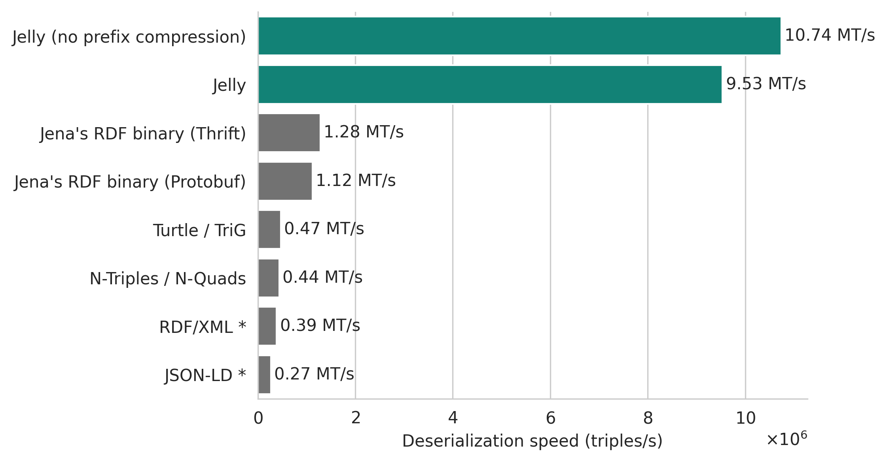

{ align=right width="150" }

# Jelly

**Jelly** is a high-performance binary serialization format and streaming protocol for [RDF](https://en.wikipedia.org/wiki/Resource_Description_Framework) knowledge graphs. Jelly has implementations for the [JVM]({{ jvm_link() }}) (works with [Apache Jena]({{ jvm_link( 'getting-started-devs' ) }}), [RDF4J]({{ jvm_link( 'user/rdf4j' ) }}), [Titanium]({{ jvm_link( 'user/titanium' ) }}), and [Neo4j]({{ jvm_link('getting-started-neo4j') }})) and [Python]({{ python_link() }}) (works with [RDFLib]({{ python_link( 'getting-started' ) }})).

<div class="grid cards" style="clear: right;" markdown>

-   :material-clock-fast:{ .lg .middle } __Stream any RDF data, <u>fast</u>__

    ---

    Jelly is blazing-fast by design, and can work with streams of triples, graphs, datasets, and more.

    [:octicons-arrow-right-24: Getting started](user-guide.md)

-   :fontawesome-solid-code:{ .lg .middle } __JVM and Python implementations__

    ---

    Fully-integrated support for [Apache Jena]({{ jvm_link( 'getting-started-devs' ) }}), [RDF4J]({{ jvm_link( 'user/rdf4j' ) }}), [Titanium]({{ jvm_link( 'user/titanium' ) }}), [Neo4j]({{ jvm_link('getting-started-neo4j') }}), and [RDFLib]({{ python_link( 'getting-started' ) }}).

    [:octicons-arrow-right-24: Jelly-JVM]({{ jvm_link() }})

    [:octicons-arrow-right-24: pyjelly]({{ python_link() }})

-   :fontawesome-solid-angles-right:{ .lg .middle } __End-to-end streaming__

    ---

    Jelly comes with a [gRPC](https://grpc.io/) protocol and can work with Kafka, MQTT, and others.

    [:octicons-arrow-right-24: User guide](user-guide.md)

    [:octicons-arrow-right-24: Streaming with Jelly-JVM]({{ jvm_link( 'user/reactive' ) }})

-   :fontawesome-solid-book:{ .lg .middle } __Open specification__

    ---

    Everything is open-source and well-documented to help you get started.

    [:octicons-arrow-right-24: Protocol specification](specification/index.md)

</div>

## ⚡ Quick start

!!! example ""

    === "CLI tool"

        [`jelly-cli`](https://github.com/Jelly-RDF/cli) is a simple tool that lets you convert RDF files to and from Jelly, validate Jelly files, and more.

        === "Install script"

            For Linux, macOS, and WSL on Windows, run:

            ```shell
            . <(curl -sSfL https://w3id.org/jelly/setup-cli.sh)
            jelly-cli
            ```

        === "mise"

            You can install `jelly-cli` on any platform (including Windows) using [mise](https://mise.jdx.dev/getting-started.html). Simply run:

            ```shell
            mise use -g 'ubi:Jelly-RDF/cli[exe=jelly-cli]'
            jelly-cli
            ```

        === "Manual download"

            You can also install `jelly-cli` manually by downloading the **[latest release](https://github.com/Jelly-RDF/cli/releases/latest)**, including a version for Windows without WSL and a platform-independent JAR file.

        **[See all available commands and documentation.](https://github.com/Jelly-RDF/cli)**

    === "Python"

        Install the [`pyjelly`]({{ python_link() }}) package with support for [RDFLib]({{ python_link( 'getting-started' ) }}):

        ```shell
        pip install pyjelly[rdflib]
        ```

        Write an RDF graph to a Jelly file:

        ```python
        from rdflib import Graph

        g = Graph()
        g.parse("http://xmlns.com/foaf/spec/index.rdf")
        g.serialize(destination="foaf.jelly", format="jelly")
        ```

        Read a Jelly file:

        ```python
        g = Graph()
        g.parse("foaf.jelly", format="jelly")
        ```

        **[See the full user guide and API reference.]({{ python_link( 'getting-started' ) }})**

        Other integrations (with or without RDFLib) are available, including Neo4j and NetworkX – see the [Python user guide]({{ python_link( 'overview' ) }}).

    === "Java"

        Jelly-JVM is a super-fast implemention of Jelly, fully integrated with [Apache Jena]({{ jvm_link( 'getting-started-devs' ) }}), [RDF4J]({{ jvm_link( 'user/rdf4j' ) }}), and [Titanium]({{ jvm_link( 'user/titanium' ) }}).

        To get started, add the following dependency to your `pom.xml`:

        === "Apache Jena"
        
            ```xml title="pom.xml"
            <dependency>
                <groupId>eu.neverblink.jelly</groupId>
                <artifactId>jelly-jena</artifactId>
                <version>{{ jvm_latest_release() }}</version>
            </dependency>
            ```

            See the full **[Jena user guide.]({{ jvm_link( 'getting-started-devs' ) }})**

        === "RDF4J"

            ```xml title="pom.xml"
            <dependency>
                <groupId>eu.neverblink.jelly</groupId>
                <artifactId>jelly-rdf4j</artifactId>
                <version>{{ jvm_latest_release() }}</version>
            </dependency>
            ```

            See the full **[RDF4J user guide.]({{ jvm_link( 'user/rdf4j' ) }})**

        === "Titanium"

            ```xml title="pom.xml"
            <dependency>
                <groupId>eu.neverblink.jelly</groupId>
                <artifactId>jelly-titanium-rdf-api</artifactId>
                <version>{{ jvm_latest_release() }}</version>
            </dependency>
            ```

            See the full **[Titanium RDF API user guide.]({{ jvm_link( 'user/titanium' ) }})**

    === "Apache Jena plugin"

        Quickly add Jelly support to your [Apache Jena Fuseki server](https://jena.apache.org/documentation/fuseki2/index.html) (5.2.0+) or other Jena-based applications:

        1. Download the [Jelly plugin JAR (version {{ jvm_latest_release() }})](https://github.com/Jelly-RDF/jelly-jvm/releases/download/v{{ jvm_latest_release() }}/jelly-jena-plugin.jar).
        2. For Apache Jena Fuseki, place the JAR in the `$FUSEKI_BASE/extra/` directory. You may need to create this directory.
        3. Start Fuseki and enjoy full support in RDF loading, APIs, SPARQL, and content negotiation.

        See the full **[Jena plugin user guide]({{ jvm_link( 'getting-started-plugins' ) }})** for more details.

    === "RDF4J plugin"

        Quickly add Jelly support to your [RDF4J](https://rdf4j.org/) applications:

        1. Download the [Jelly plugin JAR (version {{ jvm_latest_release() }})](https://github.com/Jelly-RDF/jelly-jvm/releases/download/v{{ jvm_latest_release() }}/jelly-rdf4j-plugin.jar).
        2. For RDF4J SDK, place the JAR in the `lib/` directory. For other applications, add the JAR to your classpath.
        3. Start the application and enjoy full Jelly support.

        See the full **[RDF4J plugin user guide]({{ jvm_link( 'getting-started-plugins#eclipse-rdf4j' ) }})** for more details.

    === "Neo4j"

        You can add Jelly support directly to your [Neo4j](https://neo4j.com/) Desktop or self-hosted server (Community / Enterprise Edition) using [our plugin]({{ jvm_link( 'getting-started-neo4j' ) }}). Alternatively, you can use the [rdflib-neo4j integration]({{ python_link( 'rdflib-neo4j-integration' ) }}), which is more limited, but also works with AuraDB.

        === "Plugin (Neo4j Desktop and self-hosted server)"

            **Installation:**
            
            1. Open the Neo4j installation folder.
            2. Download the neosemantics plugin `.jar` file from the [neosemantics releases page](https://github.com/neo4j-labs/neosemantics/releases) and place it in the `plugins` folder. The plugin's version must be the same as Neo4j's.
            3. Download the [Jelly-Neo4j plugin `.jar` file](https://github.com/Jelly-RDF/jelly-jvm/releases/download/v{{ jvm_latest_release() }}/jelly-neo4j-plugin.jar) and place it in the `plugins` folder.
            4. Restart the Neo4j server.

            You may also need to configure your instance for RDF support. See the [documentation of neosemantics](https://neo4j.com/labs/neosemantics/tutorial/) for details.

            **Usage:**

            All features of the [neosemantics plugin](https://neo4j.com/labs/neosemantics/) are supported. For example, to import a Jelly file into your Neo4j instance:

            ```cypher
            CALL n10s.rdf.import.fetch(
                'https://w3id.org/riverbench/dumps-with-results/dev.jelly.gz', 
                'Jelly'
            )
            ```

            **[See the full installation and usage guide.]({{ jvm_link( 'getting-started-neo4j' ) }})**

        === "rdflib-neo4j (AuraDB)"

            Install the [`pyjelly`]({{ python_link() }}) package with integration for Neo4j:

            ```shell
            pip install pyjelly[rdflib] rdflib-neo4j
            ```

            You can now import Jelly files into your Neo4j AuraDB or Neo4j server instance:

            ```python
            from rdflib import Graph
            from rdflib_neo4j import Neo4jStoreConfig, Neo4jStore

            neo4j_store = Graph(store=Neo4jStore(
                config=Neo4jStoreConfig(
                    # add your connection details here
                )
            ))

            neo4j_store.parse("foaf.jelly", format="jelly")
            ```

            **[See the full installation and user guide.]({{ python_link( 'rdflib-neo4j-integration' ) }})**


## How fast is it?

*Fast.* Jelly was specifically designed to serialize and deserialize streams of RDF data faster than N-Triples or other binary formats, while being [more compact than Turtle](performance/index.md#grouped-streaming-serialized-size).

The benchmarks below were performed on streams of RDF graphs or datasets, but Jelly is also good at handling streams of triples or quads ("classic" serialization). The benchmark was performed with Jelly-JVM 2.7.0 with Apache Jena 5.3.0. See: **[more benchmark results and details about the benchmark setup](performance/index.md)**.

<figure markdown="span">
  { width="100%" }
  <figcaption markdown style="max-width: 100%;">Serialization speed of a stream of RDF graphs or RDF datasets, averaged over 13 datasets (RiverBench 2.1.0 profile [`stream-mixed-rdfstar`](https://w3id.org/riverbench/v/2.1.0/profiles/stream-mixed-rdfstar), task [`stream-serialization-throughput`](https://w3id.org/riverbench/v/2.1.0/tasks/stream-serialization-throughput)).<br>* Partial results for RDF/XML and JSON-LD (some datasets not supported).<br>[More details about the benchmark](performance/index.md).</figcaption>
</figure>

<figure markdown="span">
  { width="100%" }
  <figcaption markdown style="max-width: 100%;">Deserialization (parsing) speed of a stream of RDF graphs or RDF datasets, averaged over 13 datasets (RiverBench 2.1.0 profile [`stream-mixed-rdfstar`](https://w3id.org/riverbench/v/2.1.0/profiles/stream-mixed-rdfstar), task [`stream-deserialization-throughput`](https://w3id.org/riverbench/v/2.1.0/tasks/stream-deserialization-throughput)).<br>* Partial results for RDF/XML and JSON-LD (some datasets not supported).<br>[More details about the benchmark](performance/index.md).</figcaption>
</figure>

## What can I use it for?

Common use cases for Jelly include:

- **Client-server communication** – connect frontend and backend with less latency, improving user experience.
- **Inter-service communication** – efficiently exchange RDF data between microservices in complex backend applications.
- **Database dumps and bulk loads** – quickly write and read large RDF datasets, reducing storage space and time needed for database maintenance tasks.
- **Streaming ingest** – eliminate ingestion bottlenecks in systems processing large amounts of incoming streaming data.
- **Database replication and change capture (new!)** – record add/delete operations in RDF datasets with transaction support using **[Jelly-Patch](specification/patch.md)**.

See also [concrete examples of Jelly being used](use-cases.md), along with [example datasets](use-cases.md#example-datasets-in-the-jelly-format).

## Commercial and community support

**[NeverBlink](https://neverblink.eu)** provides commercial support services for Jelly, including implementing custom features, system integrations, implementations for new frameworks, benchmarking, and more.

Community support is available on the **[Jelly Discord chat](https://discord.gg/A8sN5XwVa5)**.

## See also

- **[User guide](user-guide.md)**
- **[Performance benchmarks](performance/index.md)**
- **[Protocol specification](specification/index.md)**
- **[Contributing to Jelly](contributing/index.md)**
- **[Discord chat](https://discord.gg/A8sN5XwVa5)**
- **Code on GitHub:** 
    - [Protocol definition](https://github.com/Jelly-RDF/jelly-protobuf)
    - [JVM implementation](https://github.com/Jelly-RDF/jelly-jvm)
    - [Python implementation](https://github.com/Jelly-RDF/pyjelly)
    - [Rust implementation](https://github.com/Jelly-RDF/jelly.rs) *(experimental)*
    - [Command-line utility (`jelly-cli`)](https://github.com/Jelly-RDF/cli)
    - [Website](https://github.com/Jelly-RDF/jelly-rdf.github.io)
- **[Licensing and citation](licensing/index.md)**


----

The development of the Jelly protocol, its implementations, and supporting tooling was co-funded by the European Union. **[More details](licensing/projects.md)**.


