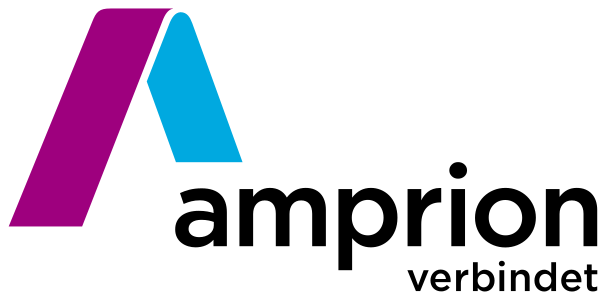
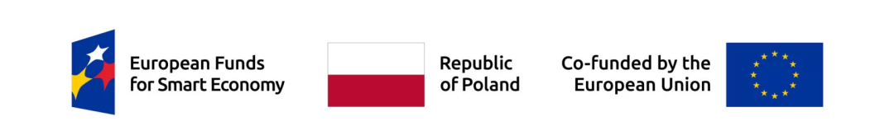

# Projects and funding

The development of the Jelly protocol, its implementations, and supporting tooling was funded from various sources, including the projects listed below.

## Amprion – commercial sponsor

[Amprion](https://www.amprion.net/index-2.html) is a German electricity transmission system operator (TSO). Amprion has sponsored the development of the Jelly-SPARQL protocol and its implementations, as well as the development of supporting tooling.

<figure markdown="span">
  [{ width="300" }](https://www.amprion.net/index-2.html)
</figure>

## Startup Booster Poland – HugeThing Sector Agnostic

[NeverBlink](https://neverblink.eu) has received a grant from the [European Funds for Smart Economy in Poland (FENG)](https://www.nowoczesnagospodarka.gov.pl/) for a project to (1) introduce a new feature for the Jelly protocol, (2) implement the Jelly protocol in Python, and (3) test the protocol's integration with existing systems on new test infrastructure, funded from the grant.

Project no. 0021/2025, funding program FENG.02.28-IP.02-0006/23 (Startup Booster Poland – HugeThing Sector Agnostic).

**Total cost of project:** 149 941,44 PLN  
**Contribution from European Funds:** 149 941,44 PLN​

## See also

- [Licensing and citation](index.md)
- [Contributing to Jelly](../contributing/index.md)
