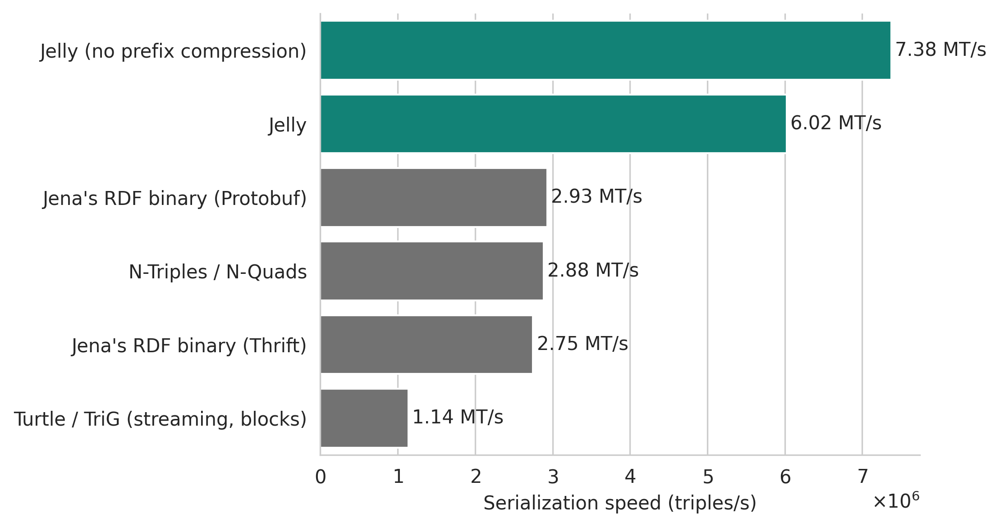
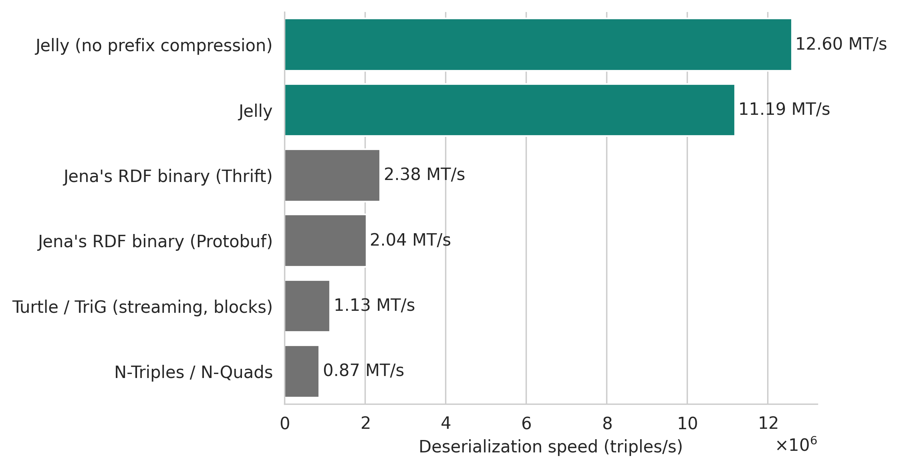

# Performance benchmarks

The following results were obtained by benchmarking [Jelly-JVM]({{ jvm_link() }}) against serializations built into Apache Jena (including binary formats).

The benchmarks were performed on two kinds of RDF streams (according to the [RDF-STaX taxonomy](https://w3id.org/stax/dev/taxonomy)):

- **Flat RDF streams** – streams of RDF triples or quads. This is the "classic" serialization – equivalent to, for example N-Triples or N-Quads.
- **Grouped RDF streams** – streams of RDF graphs or datasets.

Jelly has a major performance advantage especially in grouped RDF streams. This is mostly due to Jelly being the only tested serialization that natively supports [grouped RDF streams](https://w3id.org/stax/dev/taxonomy). Because of this, Jelly can exploit the repeating terms, prefixes, and structures in the stream to achieve much better compression and serialization speed.

If you are only interested in parsing/writing a single graph or dataset, look at the **flat** streaming results.

## Benchmark setup

All benchmarks presented here were performed using the [RiverBench benchmark suite, version 2.1.0](https://w3id.org/riverbench/v/2.1.0). Out of the 13 used datasets (all datasets available in RiverBench 2.1.0), 1 used RDF-star, and 3 included RDF quads/datasets. You can find the links to the specific used RiverBench profiles and tasks in the results below.

The benchmarks were executed using [this code (Apache 2.0)](https://github.com/Jelly-RDF/jvm-benchmarks/tree/88d936a87d0dcd9f7fb5f3dc98af7d4c270711e9) in a JVM with options: `-Xms1G -Xmx32G`. The large heap size was necessary to fit the benchmark data in memory, making the benchmark independent of disk I/O.

Hardware: AMD Ryzen 9 7900 (12-core, 24-thread, 5.0 GHz); 64 GB RAM (DDR5 5600 MT/s). The disk was not used during the benchmarks (all data was in memory). The throughput benchmarks are single-threaded, but the JVM was allowed to use all available cores for garbage collection, JIT compilation, and other tasks.

Software: Linux kernel 6.8.12, Oracle GraalVM 22.0.2+9, Apache Jena 5.0.0, [Jelly-JVM]({{ jvm_link() }}) 0.14.2 (equivalent to Jelly-JVM 1.0.0).

### Tested methods

- W3C RDF/XML (Apache Jena 5.0.0, `RDFXML_PLAIN`)
- W3C N-Triples / N-Quads (Apache Jena 5.0.0, `NTRIPLES` and `NQUADS`)
- W3C JSON-LD (Apache Jena 5.0.0, `JSONLD_PLAIN`)
- W3C Turtle / TriG (Apache Jena 5.0.0)
    - In grouped streaming, the default (`TURTLE_PRETTY` and `TRIG_PRETTY`) Turtle/TriG variant was used. 
    - In flat streaming, the `TURTLE_BLOCKS` and `TRIG_BLOCKS` variant was used. See [Jena's documentation on streaming writers for more details](https://jena.apache.org/documentation/io/streaming-io.html).
- [Jena's RDF binary](https://jena.apache.org/documentation/io/rdf-binary.html) Protobuf format (Apache Jena 5.0.0, `RDF_PROTO`)
- [Jena's RDF binary](https://jena.apache.org/documentation/io/rdf-binary.html) Thrift format (Apache Jena 5.0.0, `RDF_THRIFT`)
- Jelly (Jelly-JVM 0.14.2, "big" preset)
    ```protobuf
    max_name_table_size = 4000;
    max_prefix_table_size = 150;
    max_datatype_table_size = 32;
    ```
- Jelly without prefix compression (Jelly-JVM 0.14.2, "big" preset with prefix table disabled)
    ```protobuf
    max_name_table_size = 4000;
    max_prefix_table_size = 0;  // Prefix table disabled
    max_datatype_table_size = 32;
    ```

## Results

!!! warning

    The results below were averaged over all datasets used in the benchmarks. For RDF/XML and JSON-LD the results are **incomplete** due to missing support for some datasets. For them, only the datasets that were successfully processed are included in the averages.
    
    RDF/XML failed on 5 out of 13 datasets due to lack of support for RDF datasets (`assist-iot-weather-graphs`, `citypulse-graphs`, `nanopubs`), RDF-star (`yago-annotated-facts`), and no support for encoding ASCII control characters (`politiquices` – see [RiverBench documentation](https://w3id.org/riverbench/v/2.1.0/documentation/dataset-compat-notes) for more details).

    JSON-LD failed on 1 out of 13 datasets due to lack of support for RDF-star (`yago-annotated-facts`).


### Serialized size

- RiverBench task: [`stream-compression` (2.1.0)](https://w3id.org/riverbench/v/2.1.0/tasks/stream-compression)
- RiverBench profile: [`stream-mixed-rdfstar` (2.1.0)](https://w3id.org/riverbench/v/2.1.0/profiles/stream-mixed-rdfstar)
- The entire (full-length) datasets were used for this benchmark.
- The data was serialized to a byte-counting output stream and then discarded.

<figure markdown="span">
  { width="100%" }
  <figcaption markdown style="max-width: 100%;">Relative serialized representation size of a stream of RDF graphs or RDF datasets, geometric mean over all datasets. N-Triples/N-Quads was used as the baseline (100%).<br>* Partial results for RDF/XML and JSON-LD (some datasets not supported).</figcaption>
</figure>

Note that the results for the equivalent flat streaming task ([`flat-compression`](https://w3id.org/riverbench/v/2.1.0/tasks/flat-compression)) would be almost identical for natively streaming formats: N-Triples/N-Quads, Jena's RDF binary Protobuf, Jena's RDF binary Thrift, and Jelly. The difference would be on the order of single bytes per RDF graph/dataset.

### Flat streaming serialization throughput

- RiverBench task: [`flat-serialization-throughput` (2.1.0)](https://w3id.org/riverbench/v/2.1.0/tasks/flat-serialization-throughput)
- RiverBench profile: [`flat-mixed-rdfstar` (2.1.0)](https://w3id.org/riverbench/v/2.1.0/profiles/flat-mixed-rdfstar)
- The first 5,000,000 statements of each dataset were used for this benchmark.
- Each method/dataset combination was run 15 times, the first 5 runs were discarded to account for JVM warmup, and the remaining 10 runs were averaged.
- The data was preloaded into memory and serialized to a null output stream.

<figure markdown="span">
  { width="100%" }
  <figcaption markdown style="max-width: 100%;">Serialization speed of a stream of RDF triples or quads, averaged over all datasets.</figcaption>
</figure>

Jelly achieves very similar results to Jena's binary formats here. However, it should be noted that the Jena formats feature no compression at all, and Jelly is much more compact (see [serialized size](#serialized-size)).

### Flat streaming deserialization throughput

- RiverBench task: [`flat-deserialization-throughput` (2.1.0)](https://w3id.org/riverbench/v/2.1.0/tasks/flat-deserialization-throughput)
- RiverBench profile: [`flat-mixed-rdfstar` (2.1.0)](https://w3id.org/riverbench/v/2.1.0/profiles/flat-mixed-rdfstar)
- The first 5,000,000 statements of each dataset were used for this benchmark.
- Each method/dataset combination was run 15 times, the first 5 runs were discarded to account for JVM warmup, and the remaining 10 runs were averaged.
- Before running the benchmark, the data was serialized to a single byte array and then deserialized from it. The deserializer was emitting only a stream of triples/quads, without any further processing.

<figure markdown="span">
  { width="100%" }
  <figcaption markdown style="max-width: 100%;">Deserialization (parsing) speed of a stream of RDF triples or quads, averaged over all datasets.</figcaption>
</figure>

### Grouped streaming serialization throughput

- RiverBench task: [`stream-serialization-throughput` (2.1.0)](https://w3id.org/riverbench/v/2.1.0/tasks/stream-serialization-throughput)
- RiverBench profile: [`stream-mixed-rdfstar` (2.1.0)](https://w3id.org/riverbench/v/2.1.0/profiles/stream-mixed-rdfstar)
- The first 100,000 stream elements of each dataset were used for this benchmark.
- Each method/dataset combination was run 15 times, the first 5 runs were discarded to account for JVM warmup, and the remaining 10 runs were averaged.
- The data was preloaded into memory and serialized to a null output stream.

<figure markdown="span">
  { width="100%" }
  <figcaption markdown style="max-width: 100%;">Serialization speed of a stream of RDF graphs or RDF datasets, averaged over all datasets.<br>* Partial results for RDF/XML and JSON-LD (some datasets not supported).</figcaption>
</figure>

### Grouped streaming deserialization throughput

- RiverBench task: [`stream-deserialization-throughput` (2.1.0)](https://w3id.org/riverbench/v/2.1.0/tasks/stream-deserialization-throughput)
- RiverBench profile: [`stream-mixed-rdfstar` (2.1.0)](https://w3id.org/riverbench/v/2.1.0/profiles/stream-mixed-rdfstar)
- The first 100,000 stream elements of each dataset were used for this benchmark.
- Each method/dataset combination was run 15 times, the first 5 runs were discarded to account for JVM warmup, and the remaining 10 runs were averaged.
- Before running the benchmark, the data was serialized to a list of byte arrays (one array per stream element) and then deserialized from it. The deserializer was emitting only a stream of triples/quads, without any further processing.

<figure markdown="span">
  { width="100%" }
  <figcaption markdown style="max-width: 100%;">Deserialization (parsing) speed of a stream of RDF graphs or RDF datasets, averaged over all datasets.<br>* Partial results for RDF/XML and JSON-LD (some datasets not supported).</figcaption>
</figure>


## See also

- [Benchmark code](https://github.com/Jelly-RDF/jvm-benchmarks/tree/88d936a87d0dcd9f7fb5f3dc98af7d4c270711e9)
- [RiverBench benchmark suite](https://w3id.org/riverbench/)
- [Jelly-JVM]({{ jvm_link() }}) – the Jelly implementation used in the benchmarks
- [User guide](user-guide.md)
