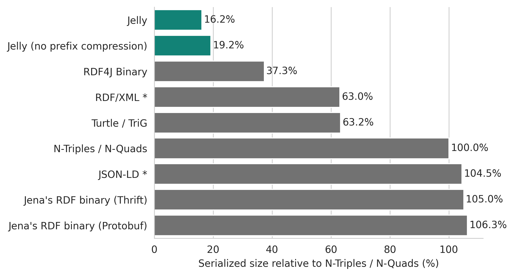
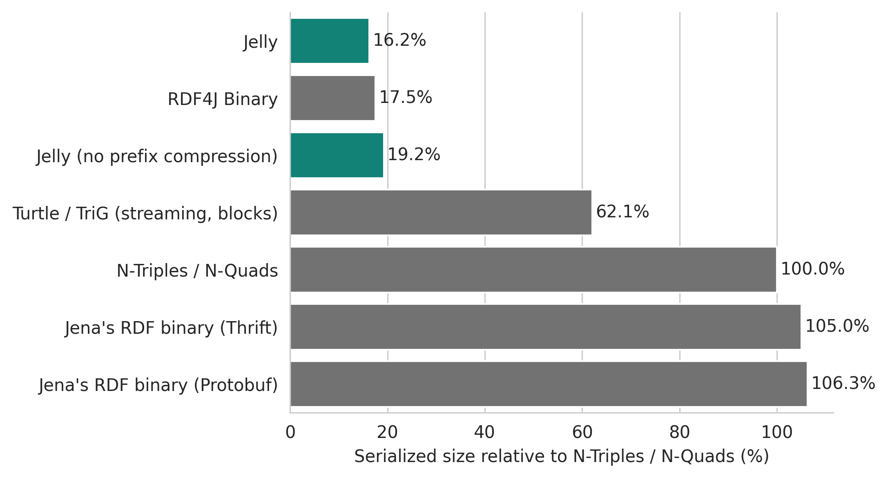
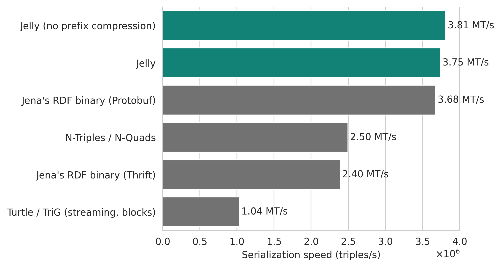
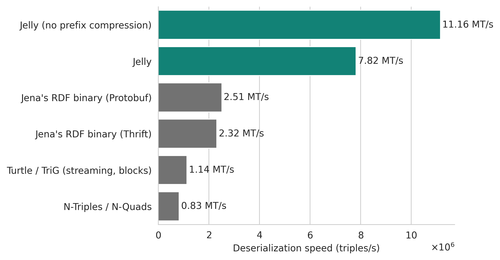

# Performance benchmarks

The following results were obtained by benchmarking [Jelly-JVM]({{ jvm_link() }}) against serializations built into Apache Jena (including binary formats).

The benchmarks were performed on two kinds of RDF streams (according to the [RDF-STaX taxonomy](https://w3id.org/stax/dev/taxonomy)):

- **Flat RDF streams** – streams of RDF triples or quads. This is the "classic" serialization – equivalent to, for example N-Triples or N-Quads.
- **Grouped RDF streams** – streams of RDF graphs or datasets.

Jelly has a major performance advantage especially in grouped RDF streams. This is mostly due to Jelly being the only tested serialization that natively supports [grouped RDF streams](https://w3id.org/stax/dev/taxonomy). Because of this, Jelly can exploit the repeating terms, prefixes, and structures in the stream to achieve much better compression and serialization speed.

If you are only interested in parsing/writing a single graph or dataset, look at the **flat** streaming results.

## Benchmark setup

All benchmarks presented here were performed using the [RiverBench benchmark suite, version 2.1.0](https://w3id.org/riverbench/v/2.1.0). Out of the 13 used datasets (all datasets available in RiverBench 2.1.0), 1 used RDF-star, and 3 included RDF quads/datasets. You can find the links to the specific used RiverBench profiles and tasks in the results below.

The benchmarks were executed using [this code (Apache 2.0 license)](https://github.com/Jelly-RDF/jvm-benchmarks/tree/281538515d3c93d7126da657df82284590dfb2df) in a JVM with options: `-Xms1G -Xmx32G`. The large heap size was necessary to fit the benchmark data in memory, making the benchmark independent of disk I/O.

Hardware: AMD Ryzen 9 7900 (12-core, 24-thread, 5.0 GHz); 64 GB RAM (DDR5 5600 MT/s). The disk was not used during the benchmarks (all data was in memory). The throughput benchmarks are single-threaded, but the JVM was allowed to use all available cores for garbage collection, JIT compilation, and other tasks.

Software: Linux kernel 6.10.11, Oracle GraalVM 23.0.2+7.1, Apache Jena 5.3.0, Eclipse RDF4J 5.1.2, [Jelly-JVM]({{ jvm_link() }}) 2.7.0.

### Tested methods

- W3C RDF/XML (Apache Jena 5.3.0, `RDFXML_PLAIN`)
- W3C N-Triples / N-Quads (Apache Jena 5.3.0, `NTRIPLES` and `NQUADS`)
- W3C JSON-LD (Apache Jena 5.3.0, `JSONLD_PLAIN`)
- W3C Turtle / TriG (Apache Jena 5.3.0)
    - In grouped streaming, the default (`TURTLE_PRETTY` and `TRIG_PRETTY`) Turtle/TriG variant was used. 
    - In flat streaming, the `TURTLE_BLOCKS` and `TRIG_BLOCKS` variant was used. See [Jena's documentation on streaming writers for more details](https://jena.apache.org/documentation/io/streaming-io.html).
- [Jena's RDF binary](https://jena.apache.org/documentation/io/rdf-binary.html) Protobuf format (Apache Jena 5.3.0, `RDF_PROTO`)
- [Jena's RDF binary](https://jena.apache.org/documentation/io/rdf-binary.html) Thrift format (Apache Jena 5.3.0, `RDF_THRIFT`)
- [RDF4J Binary RDF Format](https://rdf4j.org/documentation/reference/rdf4j-binary/) (Eclipse RDF4J 5.0.2, `BINARY`)
    - *Note: to avoid confusion, on this page we only show the performance results for Apache Jena. The results for RDF4J can be found here: [RDF4J performance](rdf4j.md).*
- Jelly (Jelly-JVM 2.7.0, "big" preset)
    ```protobuf
    max_name_table_size = 4000;
    max_prefix_table_size = 150;
    max_datatype_table_size = 32;
    ```
- Jelly without prefix compression (Jelly-JVM 2.7.0, "big" preset with prefix table disabled)
    ```protobuf
    max_name_table_size = 4000;
    max_prefix_table_size = 0;  // Prefix table disabled
    max_datatype_table_size = 32;
    ```

## Results

!!! info "RDF4J performance results"

    This page only shows the performance results for Apache Jena. The results for RDF4J can be found here: **[RDF4J performance](rdf4j.md)**.

!!! warning

    The results below were averaged over all datasets used in the benchmarks. For RDF/XML and JSON-LD the results are **incomplete** due to missing support for some datasets. For them, only the datasets that were successfully processed are included in the averages.
    
    RDF/XML failed on 5 out of 13 datasets due to lack of support for RDF datasets (`assist-iot-weather-graphs`, `citypulse-graphs`, `nanopubs`), RDF-star (`yago-annotated-facts`), and no support for encoding ASCII control characters (`politiquices` – see [RiverBench documentation](https://w3id.org/riverbench/v/2.1.0/documentation/dataset-compat-notes) for more details).

    JSON-LD failed on 1 out of 13 datasets due to lack of support for RDF-star (`yago-annotated-facts`).


### Grouped streaming serialized size

- RiverBench task: [`stream-compression` (2.1.0)](https://w3id.org/riverbench/v/2.1.0/tasks/stream-compression)
- RiverBench profile: [`stream-mixed-rdfstar` (2.1.0)](https://w3id.org/riverbench/v/2.1.0/profiles/stream-mixed-rdfstar)
- The entire (full-length) datasets were used for this benchmark.
- The data was serialized to a byte-counting output stream and then discarded.

<figure markdown="span">
  { width="100%" }
  <figcaption markdown style="max-width: 100%;">Relative serialized representation size of a stream of RDF graphs or RDF datasets, geometric mean over all datasets. N-Triples/N-Quads was used as the baseline (100%).<br>* Partial results for RDF/XML and JSON-LD (some datasets not supported).</figcaption>
</figure>

Jelly has a major advantage here (~2x smaller than the next best format, RDF4J Binary), but that is because it is the *only* format that natively supports grouped RDF streams. The other formats cannot exploit the repeating patterns between elements in the stream, leading to much larger sizes.

### Flat streaming serialized size

- RiverBench task: [`flat-compression` (2.1.0)](https://w3id.org/riverbench/v/2.1.0/tasks/flat-compression)
- RiverBench profile: [`flat-mixed-rdfstar` (2.1.0)](https://w3id.org/riverbench/v/2.1.0/profiles/flat-mixed-rdfstar)
- The entire (full-length) datasets were used for this benchmark.
- The data was serialized to a byte-counting output stream and then discarded.

<figure markdown="span">
  { width="100%" }
  <figcaption markdown style="max-width: 100%;">Relative serialized representation size of a flat stream of RDF triples or RDF quads, geometric mean over all datasets. N-Triples/N-Quads was used as the baseline (100%).</figcaption>
</figure>

In flat streaming, the compression ratios for Jelly are almost identical to grouped streaming. This is also a case where RDF4J Binary has a comparable result to Jelly – it does well when serializing large batches of RDF triples/quads, because it maintains a large buffer of statements in the serializer. This means RDF4J is optimized for throughput – not latency. Jelly can do both, at the same time. Jena's binary formats have no in-built compression, and thus are much larger.

### Flat streaming serialization throughput

- RiverBench task: [`flat-serialization-throughput` (2.1.0)](https://w3id.org/riverbench/v/2.1.0/tasks/flat-serialization-throughput)
- RiverBench profile: [`flat-mixed-rdfstar` (2.1.0)](https://w3id.org/riverbench/v/2.1.0/profiles/flat-mixed-rdfstar)
- The first 5,000,000 statements of each dataset were used for this benchmark.
- Each method/dataset combination was run 15 times, the first 5 runs were discarded to account for JVM warmup, and the remaining 10 runs were averaged.
- The data was preloaded into memory and serialized to a null output stream.

<figure markdown="span">
  { width="100%" }
  <figcaption markdown style="max-width: 100%;">Serialization speed of a stream of RDF triples or quads, averaged over all datasets.</figcaption>
</figure>

When reviewing these results, it's important to remember that Jelly is faster than Jena's binary formats, while also being much more compact – see serialized size results above.

### Flat streaming deserialization throughput

- RiverBench task: [`flat-deserialization-throughput` (2.1.0)](https://w3id.org/riverbench/v/2.1.0/tasks/flat-deserialization-throughput)
- RiverBench profile: [`flat-mixed-rdfstar` (2.1.0)](https://w3id.org/riverbench/v/2.1.0/profiles/flat-mixed-rdfstar)
- The first 5,000,000 statements of each dataset were used for this benchmark.
- Each method/dataset combination was run 15 times, the first 5 runs were discarded to account for JVM warmup, and the remaining 10 runs were averaged.
- Before running the benchmark, the data was serialized to a single byte array and then deserialized from it. The deserializer was emitting only a stream of triples/quads, without any further processing.

<figure markdown="span">
  { width="100%" }
  <figcaption markdown style="max-width: 100%;">Deserialization (parsing) speed of a stream of RDF triples or quads, averaged over all datasets.</figcaption>
</figure>

### Grouped streaming serialization throughput

- RiverBench task: [`stream-serialization-throughput` (2.1.0)](https://w3id.org/riverbench/v/2.1.0/tasks/stream-serialization-throughput)
- RiverBench profile: [`stream-mixed-rdfstar` (2.1.0)](https://w3id.org/riverbench/v/2.1.0/profiles/stream-mixed-rdfstar)
- The first 100,000 stream elements of each dataset were used for this benchmark.
- Each method/dataset combination was run 15 times, the first 5 runs were discarded to account for JVM warmup, and the remaining 10 runs were averaged.
- The data was preloaded into memory and serialized to a null output stream.

<figure markdown="span">
  { width="100%" }
  <figcaption markdown style="max-width: 100%;">Serialization speed of a stream of RDF graphs or RDF datasets, averaged over all datasets.<br>* Partial results for RDF/XML and JSON-LD (some datasets not supported).</figcaption>
</figure>

### Grouped streaming deserialization throughput

- RiverBench task: [`stream-deserialization-throughput` (2.1.0)](https://w3id.org/riverbench/v/2.1.0/tasks/stream-deserialization-throughput)
- RiverBench profile: [`stream-mixed-rdfstar` (2.1.0)](https://w3id.org/riverbench/v/2.1.0/profiles/stream-mixed-rdfstar)
- The first 100,000 stream elements of each dataset were used for this benchmark.
- Each method/dataset combination was run 15 times, the first 5 runs were discarded to account for JVM warmup, and the remaining 10 runs were averaged.
- Before running the benchmark, the data was serialized to a list of byte arrays (one array per stream element) and then deserialized from it. The deserializer was emitting only a stream of triples/quads, without any further processing.

<figure markdown="span">
  { width="100%" }
  <figcaption markdown style="max-width: 100%;">Deserialization (parsing) speed of a stream of RDF graphs or RDF datasets, averaged over all datasets.<br>* Partial results for RDF/XML and JSON-LD (some datasets not supported).</figcaption>
</figure>

## See also

- **[Benchmarks with RDF4J](rdf4j.md)**
- [Benchmark code](https://github.com/Jelly-RDF/jvm-benchmarks/tree/281538515d3c93d7126da657df82284590dfb2df)
- [RiverBench benchmark suite](https://w3id.org/riverbench/)
- [Jelly-JVM]({{ jvm_link() }}) – the Jelly implementation used in the benchmarks
- [User guide](../user-guide.md)
