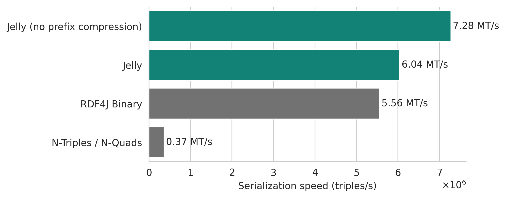

# RDF4J benchmarks

The following results were obtained by benchmarking [Jelly-JVM]({{ jvm_link() }}) against the N-Triples/N-Quads and RDF4J Binary serializations built into RDF4J.

The benchmarks were performed on two kinds of RDF streams (according to the [RDF-STaX taxonomy](https://w3id.org/stax/dev/taxonomy)):

- **Flat RDF streams** – streams of RDF triples or quads. This is the "classic" serialization – equivalent to, for example N-Triples or N-Quads.
- **Grouped RDF streams** – streams of RDF graphs or datasets.

Jelly has a major performance advantage especially in grouped RDF streams. This is mostly due to Jelly being the only tested serialization that natively supports [grouped RDF streams](https://w3id.org/stax/dev/taxonomy). Because of this, Jelly can exploit the repeating terms, prefixes, and structures in the stream to achieve much better compression and serialization speed.

If you are only interested in parsing/writing a single graph or dataset, look at the **flat** streaming results.

## Benchmark setup

The same methodology was used as in the [Apache Jena benchmarks](index.md), with the same datasets and the same setup. The benchmark was performed with Jelly-JVM 2.2.2 and RDF4J 5.0.2.

## Results

!!! info "Apache Jena performance results"

    This page only shows supplementary performance results for RDF4J. More benchmarks (including the serialized representation size) with Jena can be found here: **[Apache Jena performance](index.md)**.

!!! warning

    These results are **NOT** directly comparable with the performance results obtained on Jena. The two libraries have different APIs and internal data structures, which does affect the performance.

    The results can only be used to compare the performance within RDF4J.

### Flat streaming serialization throughput

- RiverBench task: [`flat-serialization-throughput` (2.1.0)](https://w3id.org/riverbench/v/2.1.0/tasks/flat-serialization-throughput)
- RiverBench profile: [`flat-mixed-rdfstar` (2.1.0)](https://w3id.org/riverbench/v/2.1.0/profiles/flat-mixed-rdfstar)
- The first 5,000,000 statements of each dataset were used for this benchmark.
- Each method/dataset combination was run 15 times, the first 5 runs were discarded to account for JVM warmup, and the remaining 10 runs were averaged.
- The data was preloaded into memory and serialized to a null output stream.

<figure markdown="span">
  { width="100%" }
  <figcaption markdown style="max-width: 100%;">Serialization speed of a stream of RDF triples or quads, averaged over all datasets.</figcaption>
</figure>

Flat streaming serialization is admittedly the one scenario where Jelly is pretty close to RDF4J Binary in terms of performance. RDF4J Binary is very effective at serializing big batches of RDF triples/quads, because it maintains a large buffer of statements that wait in a queue before being serialized. This does result in very good throughput, but it also hurts the latency (which is in some cases relevant) and makes it less effective for smaller batches of statements. Jelly can universally fit both use cases – see the results for grouped streams below.

### Flat streaming deserialization throughput

- RiverBench task: [`flat-deserialization-throughput` (2.1.0)](https://w3id.org/riverbench/v/2.1.0/tasks/flat-deserialization-throughput)
- RiverBench profile: [`flat-mixed-rdfstar` (2.1.0)](https://w3id.org/riverbench/v/2.1.0/profiles/flat-mixed-rdfstar)
- The first 5,000,000 statements of each dataset were used for this benchmark.
- Each method/dataset combination was run 15 times, the first 5 runs were discarded to account for JVM warmup, and the remaining 10 runs were averaged.
- Before running the benchmark, the data was serialized to a single byte array and then deserialized from it. The deserializer was emitting only a stream of triples/quads, without any further processing.

<figure markdown="span">
  { width="100%" }
  <figcaption markdown style="max-width: 100%;">Deserialization (parsing) speed of a stream of RDF triples or quads, averaged over all datasets.</figcaption>
</figure>

### Grouped streaming serialization throughput

- RiverBench task: [`stream-serialization-throughput` (2.1.0)](https://w3id.org/riverbench/v/2.1.0/tasks/stream-serialization-throughput)
- RiverBench profile: [`stream-mixed-rdfstar` (2.1.0)](https://w3id.org/riverbench/v/2.1.0/profiles/stream-mixed-rdfstar)
- The first 100,000 stream elements of each dataset were used for this benchmark.
- Each method/dataset combination was run 15 times, the first 5 runs were discarded to account for JVM warmup, and the remaining 10 runs were averaged.
- The data was preloaded into memory and serialized to a null output stream.

<figure markdown="span">
  { width="100%" }
  <figcaption markdown style="max-width: 100%;">Serialization speed of a stream of RDF graphs or RDF datasets, averaged over all datasets.</figcaption>
</figure>

### Grouped streaming deserialization throughput

- RiverBench task: [`stream-deserialization-throughput` (2.1.0)](https://w3id.org/riverbench/v/2.1.0/tasks/stream-deserialization-throughput)
- RiverBench profile: [`stream-mixed-rdfstar` (2.1.0)](https://w3id.org/riverbench/v/2.1.0/profiles/stream-mixed-rdfstar)
- The first 100,000 stream elements of each dataset were used for this benchmark.
- Each method/dataset combination was run 15 times, the first 5 runs were discarded to account for JVM warmup, and the remaining 10 runs were averaged.
- Before running the benchmark, the data was serialized to a list of byte arrays (one array per stream element) and then deserialized from it. The deserializer was emitting only a stream of triples/quads, without any further processing.

<figure markdown="span">
  { width="100%" }
  <figcaption markdown style="max-width: 100%;">Deserialization (parsing) speed of a stream of RDF graphs or RDF datasets, averaged over all datasets.</figcaption>
</figure>

## See also

- **[Benchmarks with Jena](index.md)**
- [Benchmark code](https://github.com/Jelly-RDF/jvm-benchmarks/tree/dd58f5de0916c1223ca115052567c1fb39f4cd62)
- [RiverBench benchmark suite](https://w3id.org/riverbench/)
- [Jelly-JVM]({{ jvm_link() }}) – the Jelly implementation used in the benchmarks
- [User guide](../user-guide.md)
